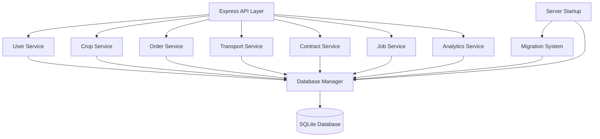
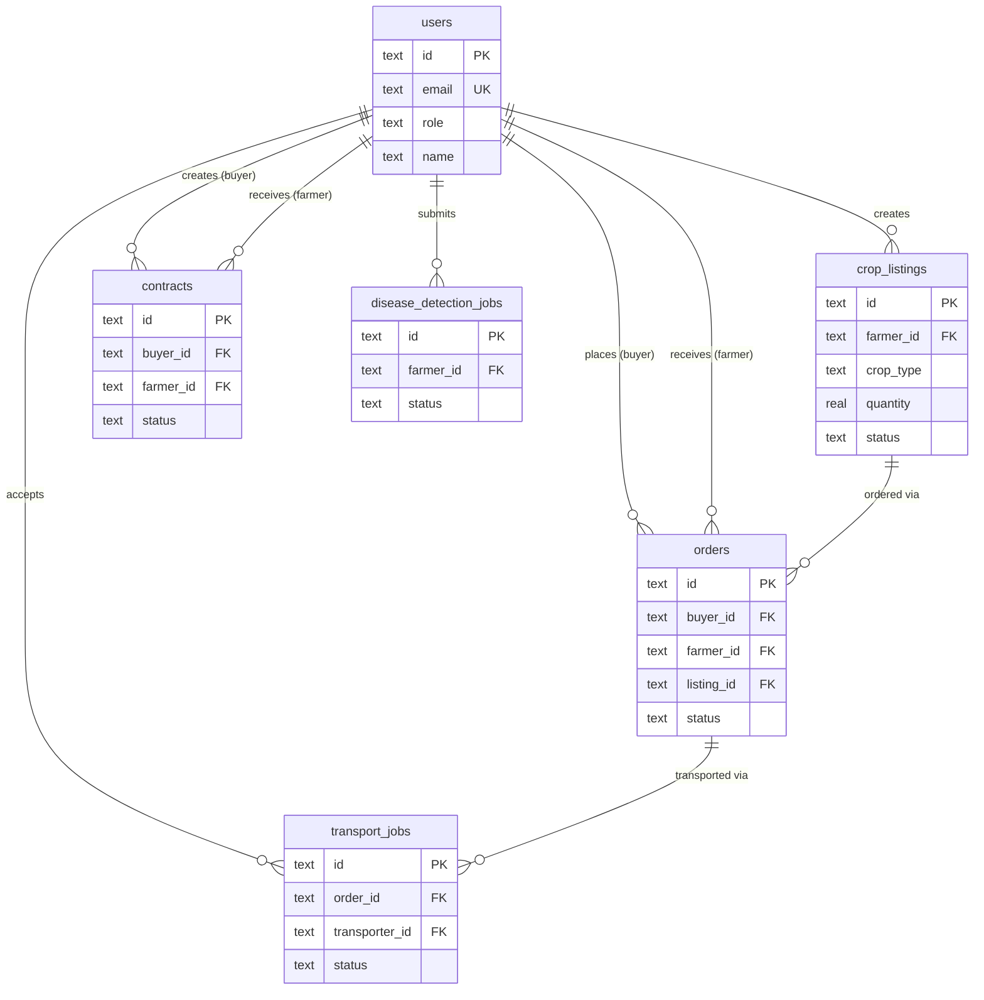

# Technical Design Document: SQLite Database Integration

## Overview

This design document specifies the technical architecture for integrating SQLite database into the agricultural AI platform. The system will replace in-memory storage with persistent SQLite storage, supporting four user roles (farmer, buyer, transporter, admin) across seven service layers.

The integration introduces a Database_Manager for connection management, a Migration_System for schema versioning, and service layers for User, Crop, Order, Transport, Contract, Job, and Analytics operations. All services will interact with SQLite through a consistent interface, with transaction support for complex operations and comprehensive error handling.

The design prioritizes simplicity (using better-sqlite3 for synchronous operations), data integrity (through transactions and constraints), and performance (through indexes and pagination). The architecture maintains separation of concerns with a clear layering: API endpoints → Service layer → Database layer.

## Architecture

### System Components



### Technology Stack

- **Database**: SQLite 3.x
- **Node.js Driver**: better-sqlite3 (synchronous API, better performance for SQLite)
- **Migration Tool**: Custom migration system using sequential versioned files
- **Backend Framework**: Express.js (existing)
- **Package Manager**: pnpm (existing)

### Design Decisions

**Why better-sqlite3 over sqlite3?**
- Synchronous API simplifies error handling and transaction management
- Better performance for SQLite's single-writer model
- No callback hell or promise chains for database operations
- Simpler integration with existing Express synchronous route handlers

**Why custom migrations over an ORM?**
- Maintains minimal dependency philosophy of the project
- Full control over SQL and schema evolution
- No learning curve for ORM-specific patterns
- Direct SQL is more transparent and debuggable

**Why service layer architecture?**
- Separates business logic from database operations
- Enables consistent validation and error handling
- Facilitates testing by isolating database interactions
- Provides clear boundaries for future refactoring

### Directory Structure

```
backend/
├── db/
│   ├── database.js           # Database Manager
│   ├── migrations/
│   │   ├── 001_initial_schema.sql
│   │   ├── 002_add_indexes.sql
│   │   └── ...
│   └── schema.sql            # Complete schema reference
├── services/
│   ├── user.service.js
│   ├── crop.service.js
│   ├── order.service.js
│   ├── transport.service.js
│   ├── contract.service.js
│   ├── job.service.js
│   └── analytics.service.js
├── controllers/
│   ├── user.controller.js
│   ├── crop.controller.js
│   ├── order.controller.js
│   ├── transport.controller.js
│   ├── contract.controller.js
│   ├── ai.controller.js      # Updated to use job.service
│   └── analytics.controller.js
├── routes/
│   ├── user.routes.js
│   ├── crop.routes.js
│   ├── order.routes.js
│   ├── transport.routes.js
│   ├── contract.routes.js
│   ├── ai.routes.js          # Existing
│   └── analytics.routes.js
└── server.js                 # Updated with DB initialization
```

## Components and Interfaces

### Database Manager (db/database.js)

The Database Manager provides a singleton interface to the SQLite database with connection management, transaction support, and query execution.

**Interface:**

```javascript
class DatabaseManager {
  constructor(dbPath)
  
  // Connection management
  initialize()                    // Create/connect to database, run migrations
  close()                         // Close database connection
  
  // Query execution
  run(sql, params)                // Execute INSERT/UPDATE/DELETE
  get(sql, params)                // Execute SELECT returning single row
  all(sql, params)                // Execute SELECT returning all rows
  
  // Transaction management
  transaction(fn)                 // Execute function within transaction
  
  // Utility
  prepare(sql)                    // Prepare statement for reuse
  checkIntegrity()                // Verify database integrity
}

// Exported singleton instance
module.exports = new DatabaseManager(process.env.DB_PATH || './data/agri-ai.db');
```

**Key Methods:**

- `initialize()`: Creates database file if needed, runs migrations, verifies integrity
- `transaction(fn)`: Wraps function in BEGIN/COMMIT with automatic ROLLBACK on error
- `run/get/all()`: Standard query methods with parameter binding for SQL injection prevention

### Migration System (db/migrations/)

The Migration System manages schema evolution through sequential SQL files with version tracking.

**Migration File Format:**

```sql
-- Migration: 001_initial_schema
-- Description: Create initial tables for users, crops, orders, etc.
-- Date: 2024-01-15

-- Up Migration
CREATE TABLE IF NOT EXISTS users (
  id TEXT PRIMARY KEY,
  email TEXT UNIQUE NOT NULL,
  password_hash TEXT NOT NULL,
  role TEXT NOT NULL CHECK(role IN ('farmer', 'buyer', 'transporter', 'admin')),
  name TEXT NOT NULL,
  phone TEXT,
  location TEXT,
  created_at TEXT NOT NULL,
  updated_at TEXT NOT NULL
);

-- Down Migration (commented for reference)
-- DROP TABLE IF EXISTS users;
```

**Migration Tracking Table:**

```sql
CREATE TABLE IF NOT EXISTS migrations (
  id INTEGER PRIMARY KEY AUTOINCREMENT,
  version INTEGER UNIQUE NOT NULL,
  name TEXT NOT NULL,
  executed_at TEXT NOT NULL
);
```

**Migration Process:**

1. On startup, Database Manager reads all .sql files from migrations/
2. Extracts version number from filename (e.g., 001_initial_schema.sql → version 1)
3. Queries migrations table for executed versions
4. Executes pending migrations in sequential order within transactions
5. Records successful migrations in migrations table
6. Fails startup if any migration fails

### Service Layer Architecture

All services follow a consistent pattern:

```javascript
class BaseService {
  constructor(db) {
    this.db = db;
  }
  
  // CRUD operations
  create(data)
  findById(id)
  findAll(filters, pagination)
  update(id, data)
  delete(id)
  
  // Validation
  validate(data)
  
  // Error handling
  handleError(error)
}
```

### User Service (services/user.service.js)

Manages user authentication and profile operations.

**Interface:**

```javascript
class UserService {
  // Authentication
  register(email, password, role, profile)  // Returns user object
  login(email, password)                    // Returns user object or null
  
  // Profile management
  getUserById(id)                           // Returns user object
  getUserByEmail(email)                     // Returns user object
  updateProfile(id, updates)                // Returns updated user
  
  // Queries
  getAllUsers(filters, pagination)          // Returns array of users
  getUsersByRole(role, pagination)          // Returns array of users
  
  // Validation
  validateEmail(email)                      // Returns boolean
  validatePassword(password)                // Returns boolean
  hashPassword(password)                    // Returns hash string
  verifyPassword(password, hash)            // Returns boolean
}
```

**Data Validation:**
- Email: RFC 5322 format validation
- Password: Minimum 8 characters, at least one uppercase, one lowercase, one number
- Role: Must be one of: farmer, buyer, transporter, admin
- Phone: Optional, E.164 format if provided

### Crop Service (services/crop.service.js)

Manages crop listings and inventory.

**Interface:**

```javascript
class CropService {
  // Listing management
  createListing(farmerId, cropData)         // Returns listing object
  getListing(id)                            // Returns listing object
  updateListing(id, updates)                // Returns updated listing
  deleteListing(id)                         // Soft delete (marks inactive)
  
  // Queries
  getActiveListings(filters, pagination)    // Returns array of listings
  getListingsByFarmer(farmerId, pagination) // Returns array of listings
  searchListings(query, filters, pagination)// Returns array of listings
  
  // Inventory
  updateQuantity(id, quantity)              // Returns updated listing
  checkAvailability(id, requestedQty)       // Returns boolean
}
```

**Filters:**
- cropType: Filter by crop type (e.g., "wheat", "rice", "corn")
- location: Filter by location/region
- priceMin/priceMax: Price range filter
- status: active/inactive

### Order Service (services/order.service.js)

Manages orders between buyers and farmers.

**Interface:**

```javascript
class OrderService {
  // Order management
  createOrder(buyerId, listingId, quantity) // Returns order object (with transaction)
  getOrder(id)                              // Returns order object with details
  updateOrderStatus(id, status)             // Returns updated order
  
  // Queries
  getOrdersByBuyer(buyerId, pagination)     // Returns array of orders
  getOrdersByFarmer(farmerId, pagination)   // Returns array of orders
  getOrdersByStatus(status, pagination)     // Returns array of orders
  
  // Business logic
  calculateTotal(listingId, quantity)       // Returns price calculation
  validateOrder(buyerId, listingId, qty)    // Returns validation result
}
```

**Order Statuses:**
- pending: Order created, awaiting farmer confirmation
- confirmed: Farmer confirmed order
- in_transit: Order assigned to transporter
- delivered: Order completed
- cancelled: Order cancelled

**Transaction Logic:**
Creating an order involves:
1. Validate listing exists and has sufficient quantity
2. Calculate order total
3. Create order record
4. Update listing quantity
5. All within a single transaction

### Transport Service (services/transport.service.js)

Manages transport jobs and deliveries.

**Interface:**

```javascript
class TransportService {
  // Job management
  createJob(orderId, pickupLocation, deliveryLocation) // Returns job object
  getJob(id)                                           // Returns job object
  acceptJob(jobId, transporterId)                      // Returns updated job (with transaction)
  completeJob(jobId)                                   // Returns updated job (with transaction)
  
  // Queries
  getAvailableJobs(filters, pagination)                // Returns array of jobs
  getJobsByTransporter(transporterId, pagination)      // Returns array of jobs
  getJobsByStatus(status, pagination)                  // Returns array of jobs
}
```

**Job Statuses:**
- available: Job created, awaiting transporter
- in_progress: Transporter accepted job
- completed: Delivery completed
- cancelled: Job cancelled

**Transaction Logic:**
Accepting a job involves:
1. Validate job is available
2. Update job status and assign transporter
3. Update related order status to "in_transit"
4. All within a single transaction

### Contract Service (services/contract.service.js)

Manages contracts between buyers and farmers.

**Interface:**

```javascript
class ContractService {
  // Contract management
  createContract(buyerId, farmerId, contractData)  // Returns contract object
  getContract(id)                                  // Returns contract object
  updateContract(id, updates)                      // Returns updated contract
  terminateContract(id, reason)                    // Returns terminated contract
  
  // Queries
  getContractsByBuyer(buyerId, pagination)         // Returns array of contracts
  getContractsByFarmer(farmerId, pagination)       // Returns array of contracts
  getActiveContracts(filters, pagination)          // Returns array of contracts
  
  // Business logic
  renewContract(id, newDuration)                   // Creates new contract
  checkExpiration()                                // Updates expired contracts
}
```

**Contract Statuses:**
- active: Contract in effect
- expired: Contract duration ended
- terminated: Contract ended early

### Job Service (services/job.service.js)

Manages disease detection jobs (replaces in-memory jobStore).

**Interface:**

```javascript
class JobService {
  // Job management
  createJob(farmerId, type, input)          // Returns job object
  getJob(id)                                // Returns job object
  updateJob(id, updates)                    // Returns updated job
  
  // Queries
  getJobsByFarmer(farmerId, pagination)     // Returns array of jobs
  getJobsByStatus(status, pagination)       // Returns array of jobs
  getJobHistory(farmerId, limit)            // Returns recent jobs
  
  // Statistics
  getJobStats(farmerId)                     // Returns job statistics
}
```

**Job Statuses:**
- pending: Job created, awaiting processing
- processing: Job being analyzed
- completed: Job finished successfully
- failed: Job failed with error

### Analytics Service (services/analytics.service.js)

Provides aggregated data and reports for admin dashboard.

**Interface:**

```javascript
class AnalyticsService {
  // User analytics
  getUserCountByRole()                      // Returns object with counts
  getNewUsersCount(startDate, endDate)      // Returns count
  
  // Order analytics
  getTotalOrders(startDate, endDate)        // Returns count
  getTotalRevenue(startDate, endDate)       // Returns sum
  getOrdersByStatus()                       // Returns object with counts
  
  // Crop analytics
  getActiveListingsCount()                  // Returns count
  getListingsByCropType()                   // Returns array with counts
  
  // Transport analytics
  getCompletedJobsCount(startDate, endDate) // Returns count
  getJobsByTransporter(limit)               // Returns top transporters
  
  // Disease detection analytics
  getJobStatsByStatus()                     // Returns object with counts
  getJobTrends(startDate, endDate)          // Returns time series data
  
  // Performance analytics
  getTopFarmers(limit)                      // Returns farmers by order volume
  getTopBuyers(limit)                       // Returns buyers by order volume
}
```

## Data Models

### Database Schema

**users table:**

```sql
CREATE TABLE users (
  id TEXT PRIMARY KEY,                    -- UUID
  email TEXT UNIQUE NOT NULL,
  password_hash TEXT NOT NULL,
  role TEXT NOT NULL CHECK(role IN ('farmer', 'buyer', 'transporter', 'admin')),
  name TEXT NOT NULL,
  phone TEXT,
  location TEXT,
  created_at TEXT NOT NULL,               -- ISO 8601 timestamp
  updated_at TEXT NOT NULL
);

CREATE INDEX idx_users_email ON users(email);
CREATE INDEX idx_users_role ON users(role);
```

**crop_listings table:**

```sql
CREATE TABLE crop_listings (
  id TEXT PRIMARY KEY,                    -- UUID
  farmer_id TEXT NOT NULL,
  crop_type TEXT NOT NULL,
  quantity REAL NOT NULL,                 -- In kg or tons
  unit TEXT NOT NULL,                     -- 'kg' or 'ton'
  price_per_unit REAL NOT NULL,
  location TEXT NOT NULL,
  description TEXT,
  image_path TEXT,
  status TEXT NOT NULL DEFAULT 'active' CHECK(status IN ('active', 'inactive')),
  created_at TEXT NOT NULL,
  updated_at TEXT NOT NULL,
  FOREIGN KEY (farmer_id) REFERENCES users(id)
);

CREATE INDEX idx_crops_farmer ON crop_listings(farmer_id);
CREATE INDEX idx_crops_type ON crop_listings(crop_type);
CREATE INDEX idx_crops_status ON crop_listings(status);
CREATE INDEX idx_crops_location ON crop_listings(location);
```

**orders table:**

```sql
CREATE TABLE orders (
  id TEXT PRIMARY KEY,                    -- UUID
  buyer_id TEXT NOT NULL,
  farmer_id TEXT NOT NULL,
  listing_id TEXT NOT NULL,
  quantity REAL NOT NULL,
  unit TEXT NOT NULL,
  price_per_unit REAL NOT NULL,
  total_price REAL NOT NULL,
  status TEXT NOT NULL DEFAULT 'pending' CHECK(status IN ('pending', 'confirmed', 'in_transit', 'delivered', 'cancelled')),
  created_at TEXT NOT NULL,
  updated_at TEXT NOT NULL,
  FOREIGN KEY (buyer_id) REFERENCES users(id),
  FOREIGN KEY (farmer_id) REFERENCES users(id),
  FOREIGN KEY (listing_id) REFERENCES crop_listings(id)
);

CREATE INDEX idx_orders_buyer ON orders(buyer_id);
CREATE INDEX idx_orders_farmer ON orders(farmer_id);
CREATE INDEX idx_orders_status ON orders(status);
CREATE INDEX idx_orders_created ON orders(created_at);
```

**transport_jobs table:**

```sql
CREATE TABLE transport_jobs (
  id TEXT PRIMARY KEY,                    -- UUID
  order_id TEXT NOT NULL,
  transporter_id TEXT,
  pickup_location TEXT NOT NULL,
  delivery_location TEXT NOT NULL,
  status TEXT NOT NULL DEFAULT 'available' CHECK(status IN ('available', 'in_progress', 'completed', 'cancelled')),
  accepted_at TEXT,
  completed_at TEXT,
  created_at TEXT NOT NULL,
  updated_at TEXT NOT NULL,
  FOREIGN KEY (order_id) REFERENCES orders(id),
  FOREIGN KEY (transporter_id) REFERENCES users(id)
);

CREATE INDEX idx_transport_order ON transport_jobs(order_id);
CREATE INDEX idx_transport_transporter ON transport_jobs(transporter_id);
CREATE INDEX idx_transport_status ON transport_jobs(status);
```

**contracts table:**

```sql
CREATE TABLE contracts (
  id TEXT PRIMARY KEY,                    -- UUID
  buyer_id TEXT NOT NULL,
  farmer_id TEXT NOT NULL,
  crop_type TEXT NOT NULL,
  quantity REAL NOT NULL,
  unit TEXT NOT NULL,
  price_per_unit REAL NOT NULL,
  duration_months INTEGER NOT NULL,
  terms TEXT,
  status TEXT NOT NULL DEFAULT 'active' CHECK(status IN ('active', 'expired', 'terminated')),
  start_date TEXT NOT NULL,
  end_date TEXT NOT NULL,
  termination_date TEXT,
  termination_reason TEXT,
  created_at TEXT NOT NULL,
  updated_at TEXT NOT NULL,
  FOREIGN KEY (buyer_id) REFERENCES users(id),
  FOREIGN KEY (farmer_id) REFERENCES users(id)
);

CREATE INDEX idx_contracts_buyer ON contracts(buyer_id);
CREATE INDEX idx_contracts_farmer ON contracts(farmer_id);
CREATE INDEX idx_contracts_status ON contracts(status);
CREATE INDEX idx_contracts_end_date ON contracts(end_date);
```

**disease_detection_jobs table:**

```sql
CREATE TABLE disease_detection_jobs (
  id TEXT PRIMARY KEY,                    -- UUID
  farmer_id TEXT NOT NULL,
  type TEXT NOT NULL DEFAULT 'disease-detection',
  image_path TEXT,
  status TEXT NOT NULL DEFAULT 'pending' CHECK(status IN ('pending', 'processing', 'completed', 'failed')),
  result TEXT,                            -- JSON string with analysis results
  error TEXT,
  created_at TEXT NOT NULL,
  updated_at TEXT NOT NULL,
  FOREIGN KEY (farmer_id) REFERENCES users(id)
);

CREATE INDEX idx_jobs_farmer ON disease_detection_jobs(farmer_id);
CREATE INDEX idx_jobs_status ON disease_detection_jobs(status);
CREATE INDEX idx_jobs_created ON disease_detection_jobs(created_at);
```

**migrations table:**

```sql
CREATE TABLE migrations (
  id INTEGER PRIMARY KEY AUTOINCREMENT,
  version INTEGER UNIQUE NOT NULL,
  name TEXT NOT NULL,
  executed_at TEXT NOT NULL
);
```

### Data Relationships



### Data Types and Constraints

**Primary Keys:**
- All tables use TEXT type for UUID primary keys (generated via uuid.v4())

**Timestamps:**
- All timestamps stored as TEXT in ISO 8601 format (YYYY-MM-DDTHH:mm:ss.sssZ)
- Enables easy sorting and filtering
- JavaScript Date objects convert naturally to/from this format

**Foreign Keys:**
- SQLite foreign key constraints enabled via `PRAGMA foreign_keys = ON`
- Cascading deletes not used (soft deletes preferred for audit trail)

**Check Constraints:**
- Enum-like values enforced via CHECK constraints (role, status fields)
- Ensures data integrity at database level

**Unique Constraints:**
- User email must be unique
- Migration version must be unique

**Indexes:**
- Created on all foreign keys for join performance
- Created on frequently filtered columns (status, role, created_at)
- Created on search columns (email, crop_type, location)


## Correctness Properties

*A property is a characteristic or behavior that should hold true across all valid executions of a system—essentially, a formal statement about what the system should do. Properties serve as the bridge between human-readable specifications and machine-verifiable correctness guarantees.*

### Property Reflection

After analyzing all acceptance criteria, several redundant properties were identified and consolidated:

- Migration ordering (1.3 and 9.3) → Combined into single property
- Migration failure handling (1.4 and 9.5) → Combined into single edge case
- User/Crop/Order/Transport/Contract/Job field persistence → Consolidated into generic persistence properties per service
- Pagination across services (13.2, 13.3, 13.4) → Combined into single pagination property
- Transaction atomicity (12.1, 12.2) → Combined into single transaction property

The following properties represent the unique, non-redundant correctness guarantees:

### Property 1: Migration Sequential Execution

*For any* set of migration files with version numbers, when the Database_Manager executes pending migrations, they SHALL be executed in ascending order by version number.

**Validates: Requirements 1.3, 9.3**

### Property 2: Migration Idempotence

*For any* migration that has already been executed, when the Database_Manager initializes, it SHALL skip that migration without re-executing it.

**Validates: Requirements 9.4**

### Property 3: Migration Recording

*For any* migration that executes successfully, the Migration_System SHALL create a record in the migrations table with the version number, name, and execution timestamp.

**Validates: Requirements 9.1, 9.2**

### Property 4: User Registration Uniqueness

*For any* user registration with email and password, the User_Service SHALL create a user record with a unique identifier that differs from all existing user identifiers.

**Validates: Requirements 2.2**

### Property 5: User Credential Verification

*For any* registered user, when logging in with correct credentials, the User_Service SHALL return the user object, and when logging in with incorrect credentials, the User_Service SHALL return null or an error.

**Validates: Requirements 2.3**

### Property 6: User Profile Round-Trip

*For any* user created in the system, retrieving that user by their unique identifier or email SHALL return a user object with all originally stored fields (email, role, name, phone, location).

**Validates: Requirements 2.1, 2.6**

### Property 7: User Profile Update Persistence

*For any* user and any valid profile updates, when the User_Service updates the profile, retrieving the user SHALL return the updated values.

**Validates: Requirements 2.5**

### Property 8: Crop Listing Round-Trip

*For any* crop listing created by a farmer, retrieving that listing by its unique identifier SHALL return a listing object with all originally stored fields (crop type, quantity, price, location, farmer identifier).

**Validates: Requirements 3.1, 3.2**

### Property 9: Crop Listing Active Filter

*For any* set of crop listings with mixed active and inactive statuses, when a buyer browses crops, the Crop_Service SHALL return only listings with status "active".

**Validates: Requirements 3.3**

### Property 10: Crop Listing Soft Delete

*For any* active crop listing, when the Crop_Service deletes it, the listing SHALL still exist in the database with status changed to "inactive".

**Validates: Requirements 3.5**

### Property 11: Crop Listing Update Timestamp

*For any* crop listing and any valid updates, when the Crop_Service updates the listing, the updated_at timestamp SHALL be greater than the original updated_at timestamp.

**Validates: Requirements 3.4**

### Property 12: Crop Listing Filtering

*For any* set of crop listings and any filter criteria (crop type, location, price range, status), the Crop_Service SHALL return only listings that match all specified filter criteria.

**Validates: Requirements 3.6**

### Property 13: Order Creation Initial Status

*For any* order created by a buyer, the Order_Service SHALL persist it with status "pending".

**Validates: Requirements 4.2**

### Property 14: Order Status Update Timestamp

*For any* order and any status change, when the Order_Service updates the status, the updated_at timestamp SHALL be greater than the original updated_at timestamp.

**Validates: Requirements 4.3**

### Property 15: Order Round-Trip

*For any* order created in the system, retrieving that order by buyer identifier, farmer identifier, or order identifier SHALL return an order object with all originally stored fields.

**Validates: Requirements 4.1, 4.4**

### Property 16: Order Total Calculation

*For any* crop listing with price_per_unit P and any order quantity Q, the Order_Service SHALL calculate total_price as P × Q.

**Validates: Requirements 4.5**

### Property 17: Order Completion Inventory Update

*For any* order with quantity Q linked to a crop listing with quantity L, when the order is completed, the crop listing quantity SHALL be updated to L - Q.

**Validates: Requirements 4.6**

### Property 18: Transport Job Creation Initial Status

*For any* transport job created for an order, the Transport_Service SHALL persist it with status "available" and transporter_id as null.

**Validates: Requirements 5.2**

### Property 19: Transport Job Acceptance State Update

*For any* available transport job and any transporter, when the transporter accepts the job, the Transport_Service SHALL update the status to "in_progress" and set the transporter_id to the transporter's identifier.

**Validates: Requirements 5.3**

### Property 20: Transport Job Completion Timestamp

*For any* transport job in progress, when the Transport_Service completes the job, the status SHALL be "completed" and completed_at SHALL be set to a non-null timestamp.

**Validates: Requirements 5.4**

### Property 21: Transport Job Available Filter

*For any* set of transport jobs with mixed statuses, when retrieving available jobs, the Transport_Service SHALL return only jobs with status "available".

**Validates: Requirements 5.5**

### Property 22: Transport Job Transporter Query

*For any* transporter and any set of transport jobs, when retrieving jobs by transporter identifier, the Transport_Service SHALL return only jobs where transporter_id matches the specified identifier.

**Validates: Requirements 5.6**

### Property 23: Contract Creation Initial Status

*For any* contract created between a buyer and farmer, the Contract_Service SHALL persist it with status "active" and a start_date.

**Validates: Requirements 6.2**

### Property 24: Contract Expiration Status Update

*For any* contract with end_date in the past, when the Contract_Service checks expiration, the status SHALL be updated to "expired".

**Validates: Requirements 6.3**

### Property 25: Contract Round-Trip

*For any* contract created in the system, retrieving that contract by buyer identifier or farmer identifier SHALL return contracts with all originally stored fields.

**Validates: Requirements 6.1, 6.4**

### Property 26: Contract Renewal Creates New Record

*For any* existing contract, when the Contract_Service renews it with a new duration, a new contract record SHALL be created with a different unique identifier.

**Validates: Requirements 6.5**

### Property 27: Contract Early Termination

*For any* active contract, when the Contract_Service terminates it early, the status SHALL be "terminated" and termination_date SHALL be set to a non-null timestamp.

**Validates: Requirements 6.6**

### Property 28: Disease Detection Job Creation Initial Status

*For any* disease detection job created by a farmer, the Job_Service SHALL persist it with status "pending".

**Validates: Requirements 7.2**

### Property 29: Disease Detection Job Processing Result Storage

*For any* disease detection job that is processed successfully, the Job_Service SHALL update the status to "completed" and store the analysis result.

**Validates: Requirements 7.3**

### Property 30: Disease Detection Job Round-Trip

*For any* disease detection job created in the system, retrieving that job by farmer identifier or job identifier SHALL return a job object with all originally stored fields.

**Validates: Requirements 7.1, 7.5**

### Property 31: Disease Detection Job History Ordering

*For any* farmer with multiple disease detection jobs, when retrieving job history, the Job_Service SHALL return jobs ordered by created_at in descending order (most recent first).

**Validates: Requirements 7.6**

### Property 32: Analytics User Count By Role

*For any* set of users with various roles, the Analytics_Service SHALL calculate user counts by role such that the sum of all role counts equals the total number of users.

**Validates: Requirements 8.1**

### Property 33: Analytics Order Revenue Calculation

*For any* set of orders within a time period, the Analytics_Service SHALL calculate total revenue as the sum of all order total_price values where created_at falls within the specified period.

**Validates: Requirements 8.2**

### Property 34: Analytics Active Listings By Crop Type

*For any* set of crop listings, the Analytics_Service SHALL calculate active listings by crop type such that only listings with status "active" are counted.

**Validates: Requirements 8.3**

### Property 35: Analytics Completed Jobs By Transporter

*For any* set of transport jobs, the Analytics_Service SHALL calculate completed jobs by transporter such that only jobs with status "completed" are counted for each transporter.

**Validates: Requirements 8.4**

### Property 36: Analytics Job Statistics By Status

*For any* set of disease detection jobs, the Analytics_Service SHALL calculate job counts by status such that the sum of all status counts equals the total number of jobs.

**Validates: Requirements 8.5**

### Property 37: Analytics Top Farmers Ordering

*For any* set of orders and a limit N, the Analytics_Service SHALL return the top N farmers ordered by total order count in descending order.

**Validates: Requirements 8.6**

### Property 38: API Error Response Format

*For any* API request that fails due to a database error, the API_Layer SHALL return an HTTP response with status code 4xx or 5xx and a JSON body containing an error message.

**Validates: Requirements 10.7**

### Property 39: User Validation Rejects Invalid Email

*For any* user registration with an invalid email format, the User_Service SHALL reject the registration and return an error without creating a database record.

**Validates: Requirements 11.1, 11.6**

### Property 40: Crop Validation Rejects Invalid Data

*For any* crop listing creation with missing required fields or invalid numeric values, the Crop_Service SHALL reject the creation and return an error without creating a database record.

**Validates: Requirements 11.2, 11.6**

### Property 41: Order Validation Checks Inventory

*For any* order creation where the crop listing does not exist or has insufficient quantity, the Order_Service SHALL reject the order and return an error without creating a database record.

**Validates: Requirements 11.3, 11.6**

### Property 42: Transport Job Validation Checks Availability

*For any* transport job acceptance where the job status is not "available", the Transport_Service SHALL reject the acceptance and return an error without updating the database.

**Validates: Requirements 11.4, 11.6**

### Property 43: Contract Validation Rejects Invalid Data

*For any* contract creation with invalid date ranges or numeric values, the Contract_Service SHALL reject the creation and return an error without creating a database record.

**Validates: Requirements 11.5, 11.6**

### Property 44: Transaction Atomicity For Order Creation

*For any* order creation, if either the order insertion or the crop quantity update fails, then neither operation SHALL be persisted to the database.

**Validates: Requirements 12.1, 12.3**

### Property 45: Transaction Atomicity For Job Acceptance

*For any* transport job acceptance, if either the job update or the order status update fails, then neither operation SHALL be persisted to the database.

**Validates: Requirements 12.2, 12.3**

### Property 46: Transaction Commit On Success

*For any* transaction where all operations succeed, the Database_Manager SHALL commit all changes to the database.

**Validates: Requirements 12.4**

### Property 47: Pagination Consistency

*For any* service method that supports pagination (Crop_Service, Order_Service, Transport_Service) with page size P and page number N, the method SHALL return at most P records starting from offset N × P.

**Validates: Requirements 13.2, 13.3, 13.4**

### Property 48: Database Error Logging

*For any* database operation that fails, the Database_Manager SHALL log an error message containing the SQL query and parameters.

**Validates: Requirements 15.1**

### Property 49: Error Classification

*For any* database error, the Database_Manager SHALL classify it as either recoverable or non-recoverable based on the error type.

**Validates: Requirements 15.4**


## Error Handling

### Error Categories

**Database Connection Errors:**
- File system permission issues
- Database file corruption
- Connection pool exhaustion
- Classification: Non-recoverable (requires manual intervention)
- Response: Log error, prevent server startup or further operations

**Constraint Violation Errors:**
- Unique constraint violations (duplicate email, etc.)
- Foreign key constraint violations
- Check constraint violations (invalid enum values)
- Classification: Recoverable (client can retry with different data)
- Response: Return descriptive error to client, log violation details

**Query Execution Errors:**
- SQL syntax errors (programming bugs)
- Type mismatch errors
- Table/column not found errors
- Classification: Non-recoverable (requires code fix)
- Response: Log full error with stack trace, return generic error to client

**Transaction Errors:**
- Deadlock detection
- Transaction rollback failures
- Nested transaction errors
- Classification: Recoverable (can retry transaction)
- Response: Rollback transaction, log error, return retry-able error to client

**Validation Errors:**
- Invalid input data
- Business rule violations
- Missing required fields
- Classification: Recoverable (client can correct input)
- Response: Return detailed validation errors to client, no database operation attempted

### Error Response Format

All service layer methods return a consistent error format:

```javascript
{
  success: false,
  error: {
    code: 'ERROR_CODE',           // Machine-readable error code
    message: 'Human readable',    // User-friendly message
    details: {},                  // Additional context (optional)
    recoverable: true/false       // Whether client can retry
  }
}
```

**Error Codes:**
- `DB_CONNECTION_ERROR`: Database connection failed
- `DB_CONSTRAINT_VIOLATION`: Unique/foreign key/check constraint violated
- `DB_QUERY_ERROR`: Query execution failed
- `DB_TRANSACTION_ERROR`: Transaction failed
- `VALIDATION_ERROR`: Input validation failed
- `NOT_FOUND`: Resource not found
- `INSUFFICIENT_QUANTITY`: Inventory insufficient for order
- `INVALID_STATE`: Operation not allowed in current state

### Logging Strategy

**Log Levels:**
- ERROR: Non-recoverable errors, constraint violations, query failures
- WARN: Performance issues (slow queries), recoverable transaction errors
- INFO: Successful migrations, database initialization
- DEBUG: Query execution details (development only)

**Log Format:**

```javascript
{
  timestamp: '2024-01-15T10:30:00.000Z',
  level: 'ERROR',
  component: 'DatabaseManager',
  operation: 'run',
  message: 'Query execution failed',
  sql: 'INSERT INTO users...',
  params: ['user@example.com', '...'],
  error: {
    code: 'SQLITE_CONSTRAINT',
    message: 'UNIQUE constraint failed: users.email'
  },
  stack: '...'
}
```

### Retry Logic

**Automatic Retries:**
- Deadlock errors: Retry up to 3 times with exponential backoff
- Connection pool exhaustion: Retry up to 5 times with 100ms delay
- Transient errors: Retry up to 3 times

**No Automatic Retries:**
- Constraint violations (client must change data)
- Validation errors (client must correct input)
- SQL syntax errors (requires code fix)
- Connection errors (requires manual intervention)

### Database Integrity Checks

**On Startup:**
- Run `PRAGMA integrity_check` to verify database file integrity
- Verify all required tables exist
- Verify migrations table is consistent
- If any check fails, prevent server startup and log detailed error

**On Shutdown:**
- Close all prepared statements
- Close database connection gracefully
- Log any errors during shutdown (but don't prevent shutdown)

**Periodic Checks:**
- Log slow queries (> 1 second execution time)
- Monitor connection pool usage
- Alert if database file size exceeds threshold

## Testing Strategy

### Dual Testing Approach

This feature requires both unit tests and property-based tests for comprehensive coverage:

**Unit Tests:**
- Specific examples demonstrating correct behavior
- Edge cases (empty inputs, boundary values, error conditions)
- Integration points between services
- API endpoint request/response formats
- Migration execution and rollback scenarios

**Property-Based Tests:**
- Universal properties that hold for all inputs
- Comprehensive input coverage through randomization
- Data integrity across operations
- Transaction atomicity and consistency
- Query correctness across various data sets

### Property-Based Testing Configuration

**Library:** fast-check (JavaScript property-based testing library)
- Installation: `pnpm add -D fast-check`
- Minimum 100 iterations per property test
- Each test references its design document property

**Test Tag Format:**

```javascript
// Feature: sqlite-database-integration, Property 4: User Registration Uniqueness
test('user registration creates unique identifiers', () => {
  fc.assert(
    fc.property(fc.array(fc.emailAddress()), (emails) => {
      // Test implementation
    }),
    { numRuns: 100 }
  );
});
```

### Test Organization

```
backend/tests/
├── unit/
│   ├── database.test.js           # Database Manager unit tests
│   ├── migrations.test.js         # Migration system unit tests
│   ├── services/
│   │   ├── user.service.test.js
│   │   ├── crop.service.test.js
│   │   ├── order.service.test.js
│   │   ├── transport.service.test.js
│   │   ├── contract.service.test.js
│   │   ├── job.service.test.js
│   │   └── analytics.service.test.js
│   └── api/
│       ├── user.api.test.js
│       ├── crop.api.test.js
│       ├── order.api.test.js
│       ├── transport.api.test.js
│       ├── contract.api.test.js
│       └── analytics.api.test.js
├── property/
│   ├── user.properties.test.js
│   ├── crop.properties.test.js
│   ├── order.properties.test.js
│   ├── transport.properties.test.js
│   ├── contract.properties.test.js
│   ├── job.properties.test.js
│   ├── analytics.properties.test.js
│   └── transaction.properties.test.js
└── fixtures/
    ├── test-database.js           # Test database setup/teardown
    └── generators.js              # fast-check custom generators
```

### Test Database Setup

Each test suite uses an isolated in-memory SQLite database:

```javascript
// fixtures/test-database.js
const DatabaseManager = require('../../db/database');

function createTestDatabase() {
  const db = new DatabaseManager(':memory:');
  db.initialize();
  return db;
}

function cleanupTestDatabase(db) {
  db.close();
}

module.exports = { createTestDatabase, cleanupTestDatabase };
```

### Custom Generators

Property-based tests require custom generators for domain objects:

```javascript
// fixtures/generators.js
const fc = require('fast-check');

const userRole = fc.constantFrom('farmer', 'buyer', 'transporter', 'admin');

const user = fc.record({
  email: fc.emailAddress(),
  password: fc.string({ minLength: 8, maxLength: 20 }),
  role: userRole,
  name: fc.string({ minLength: 1, maxLength: 100 }),
  phone: fc.option(fc.string({ minLength: 10, maxLength: 15 })),
  location: fc.option(fc.string({ minLength: 1, maxLength: 200 }))
});

const cropListing = fc.record({
  cropType: fc.constantFrom('wheat', 'rice', 'corn', 'soybean', 'cotton'),
  quantity: fc.float({ min: 0.1, max: 10000 }),
  unit: fc.constantFrom('kg', 'ton'),
  pricePerUnit: fc.float({ min: 0.01, max: 1000 }),
  location: fc.string({ minLength: 1, maxLength: 200 }),
  description: fc.option(fc.string({ maxLength: 500 }))
});

// Additional generators for orders, transport jobs, contracts, etc.

module.exports = { user, cropListing, /* ... */ };
```

### Unit Test Examples

**Database Initialization:**

```javascript
test('creates database file if it does not exist', () => {
  const dbPath = './test-data/new-db.sqlite';
  if (fs.existsSync(dbPath)) fs.unlinkSync(dbPath);
  
  const db = new DatabaseManager(dbPath);
  db.initialize();
  
  expect(fs.existsSync(dbPath)).toBe(true);
  db.close();
});
```

**Migration Failure:**

```javascript
test('prevents startup when migration fails', () => {
  const db = createTestDatabase();
  
  // Create a migration that will fail
  const badMigration = 'CREATE TABLE invalid syntax;';
  fs.writeFileSync('./db/migrations/999_bad.sql', badMigration);
  
  expect(() => db.initialize()).toThrow();
  
  fs.unlinkSync('./db/migrations/999_bad.sql');
});
```

**API Endpoint:**

```javascript
test('POST /api/users/register creates user', async () => {
  const response = await request(app)
    .post('/api/users/register')
    .send({
      email: 'farmer@example.com',
      password: 'SecurePass123',
      role: 'farmer',
      name: 'John Farmer'
    });
  
  expect(response.status).toBe(201);
  expect(response.body).toHaveProperty('id');
  expect(response.body.email).toBe('farmer@example.com');
});
```

### Property-Based Test Examples

**Property 4: User Registration Uniqueness**

```javascript
// Feature: sqlite-database-integration, Property 4: User Registration Uniqueness
test('user registration creates unique identifiers', () => {
  const db = createTestDatabase();
  const userService = new UserService(db);
  
  fc.assert(
    fc.property(fc.array(generators.user, { minLength: 2, maxLength: 10 }), (users) => {
      const createdUsers = users.map(u => userService.register(u.email, u.password, u.role, u));
      const ids = createdUsers.map(u => u.id);
      const uniqueIds = new Set(ids);
      
      return ids.length === uniqueIds.size; // All IDs are unique
    }),
    { numRuns: 100 }
  );
  
  cleanupTestDatabase(db);
});
```

**Property 16: Order Total Calculation**

```javascript
// Feature: sqlite-database-integration, Property 16: Order Total Calculation
test('order total equals price per unit times quantity', () => {
  const db = createTestDatabase();
  const orderService = new OrderService(db);
  const cropService = new CropService(db);
  
  fc.assert(
    fc.property(
      generators.cropListing,
      fc.float({ min: 0.1, max: 100 }),
      (listing, orderQty) => {
        const farmer = createTestUser(db, 'farmer');
        const buyer = createTestUser(db, 'buyer');
        const createdListing = cropService.createListing(farmer.id, listing);
        
        const order = orderService.createOrder(buyer.id, createdListing.id, orderQty);
        const expectedTotal = listing.pricePerUnit * orderQty;
        
        return Math.abs(order.total_price - expectedTotal) < 0.01; // Float comparison
      }
    ),
    { numRuns: 100 }
  );
  
  cleanupTestDatabase(db);
});
```

**Property 44: Transaction Atomicity For Order Creation**

```javascript
// Feature: sqlite-database-integration, Property 44: Transaction Atomicity For Order Creation
test('order creation is atomic - both operations succeed or both fail', () => {
  const db = createTestDatabase();
  const orderService = new OrderService(db);
  const cropService = new CropService(db);
  
  fc.assert(
    fc.property(generators.cropListing, fc.float({ min: 0.1, max: 100 }), (listing, orderQty) => {
      const farmer = createTestUser(db, 'farmer');
      const buyer = createTestUser(db, 'buyer');
      const createdListing = cropService.createListing(farmer.id, listing);
      
      const initialQty = createdListing.quantity;
      
      try {
        orderService.createOrder(buyer.id, createdListing.id, orderQty);
        
        // If order creation succeeded, listing quantity must be updated
        const updatedListing = cropService.getListing(createdListing.id);
        return updatedListing.quantity === initialQty - orderQty;
      } catch (error) {
        // If order creation failed, listing quantity must be unchanged
        const unchangedListing = cropService.getListing(createdListing.id);
        return unchangedListing.quantity === initialQty;
      }
    }),
    { numRuns: 100 }
  );
  
  cleanupTestDatabase(db);
});
```

### Test Coverage Goals

- Unit test coverage: Minimum 80% line coverage
- Property test coverage: All 49 correctness properties implemented
- Integration test coverage: All API endpoints tested
- Edge case coverage: All error conditions tested

### Continuous Integration

Tests run automatically on:
- Every commit (pre-commit hook)
- Every pull request (CI pipeline)
- Before deployment (pre-deployment check)

Test execution time target: < 30 seconds for full suite

### Performance Testing

While not part of the correctness properties, performance tests should verify:
- Query execution time < 100ms for simple queries
- Query execution time < 1s for complex aggregations
- Database initialization time < 5s
- Migration execution time < 10s per migration

Performance tests run separately from correctness tests and are not blocking for deployment.

